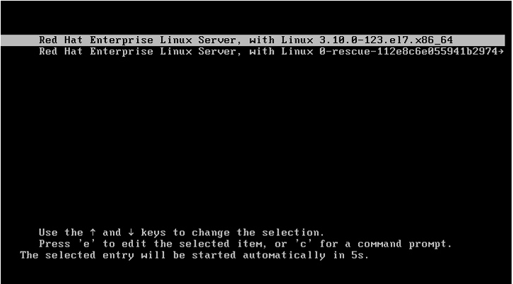
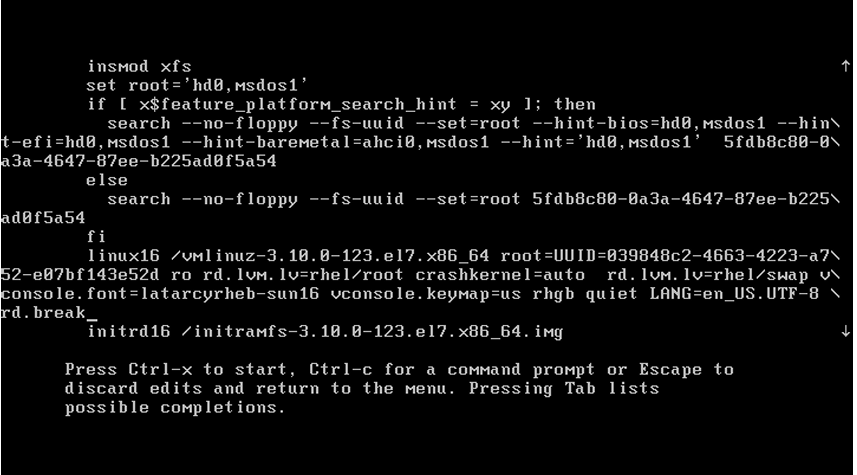
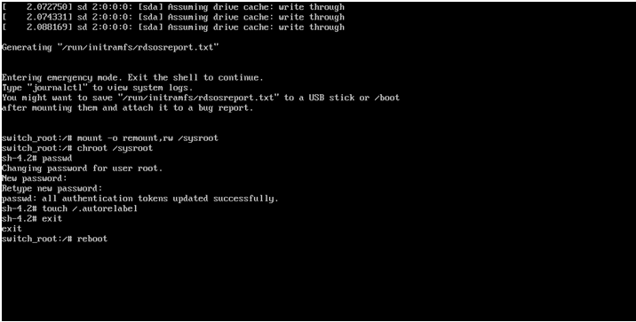

**重置root管理员密码**

若是遇到Linux管理员的密码遗忘，可以进行密码的重置工作。目前我自己的是RHEL7的系统，这个方法实测对该系统有效，其他系统有待验证！
1. 先验证系统版本
 
2. 重启Linux系统主机并出现引导界面时，**按下键盘上的e键进入内核编辑界面**，如图所示。
 
3. 在linux16 参数这行的最后面追加“rd.break”参数，然后按下Ctrl + X组合键来运行修
   改过的内核程序，如图所示。
 

    注:若是打开页面没有可以试着让光标在内容上下移来查看，一般都有的
4. 大约30秒过后，进入到系统的紧急求援模式，如图所示。

5. 依次输入以下命令，等待系统重启操作完毕，然后就可以使用新密码 linuxprobe 来登录
   Linux 系统了。命令行执行效果如图所示。
    
```
mount -o remount,rw /sysroot
   chroot /sysroot
   passwd
   touch /.autorelabel
   exit
   reboot 
```
注:可能会出现输完passwd后,【】【】【】【】root【】【】【】【】,下面的第二行【】【】【】后是设置新密码,再来一次回车出现的【】【】【】后的光标是再次确认新密码,回车后后面的照旧退出重启登录root管理账户即可。(出现这种状况可能是我没有root用户创建的原因，反正是问题解决了，但不知道为什么，只能这样猜测。)