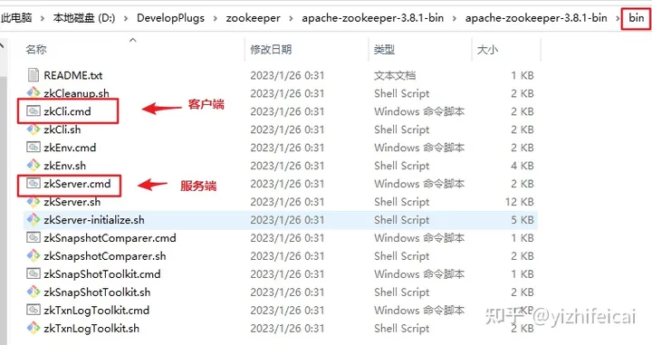
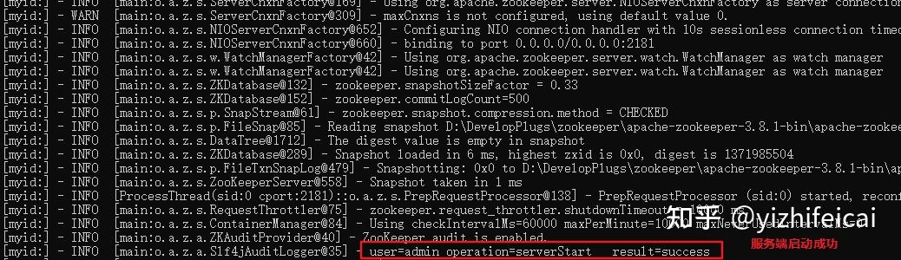
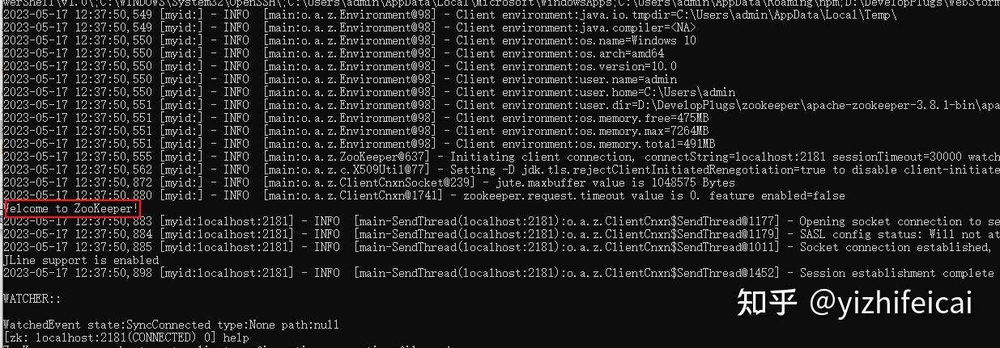

Zookeeper
目前我使用的是3.8.4版本
>前提：必须安装jdk 1.8，配置jdk环境变量，步骤略

安装解压：略

>配置data位置 复制 zoo_sample.cfg文件改名为zoo.cfg，修改dataDir位置

说明：请将datDir目录修改成自己实际目录（没有就自己创建一个data目录）

**注意：ZooKeeper启动错误：ZooKeeper audit is disabled**

zookeeper新版本启动的过程中，zookeeper新增的审核日志是默认关闭，所以控制台输出ZooKeeper audit is disabled，标准的修改方式应该是在zookeeper的配置文件zoo.cfg新增一行audit.enable=true即可

>使用
1.3.1、开启服务端

1.3.2、开启客户端


服务端启动成功显示：


客服端启动成功显示：


>命令使用
```
help（查看所有zk命令）
​
ls  查看命令
 ls -R /quota_test    
    显示 
#   /quota_test
#   /quota_test/child_1
#   /quota_test/child_2
    /quota_test/child_3
 
 ls -s /quota_test
    显示
#   [child_1, child_2, child_3]
#   cZxid = 0x110000002d
#   ctime = Thu Mar 07 11:19:07 UTC 2019
#   mtime = Thu Mar 07 11:19:07 UTC 2019
#   pZxid = 0x1100000033
#   cversion = 3
#   dataVersion = 0
#   aclVersion = 0
#   ephemeralOwner = 0x0
#   dataLength = 0
#   numChildren = 3
  
  ls -w /brokers    为brokers节点添加监视器，当brokers添加或删除子节点时会提示
#   WATCHER::
​
#WatchedEvent state:SyncConnected type:NodeChildrenChanged path:/app2
```

2.2 创建节点
```
create [-s] [-e] [-c] [-t ttl] path [data] [acl]
    [-s]        自动添加序号（自增）
    [-e]        表示为零时节点
    [-c]        创建容器节点
    [-t ttl]        创建ttl节点，可以指定超时时间，3.6.0之后版本出现
    path        节点路径名 根目录为/，每个/代表一层  最后一个/后的内容为当前创建的节点名，若节点名前几层的节点不存在时当前节点创建时会报错，不会自动创建
    [data]      节点数据 "data"   和path类似与  Key：value 
    [acl]       节点访问权限
```